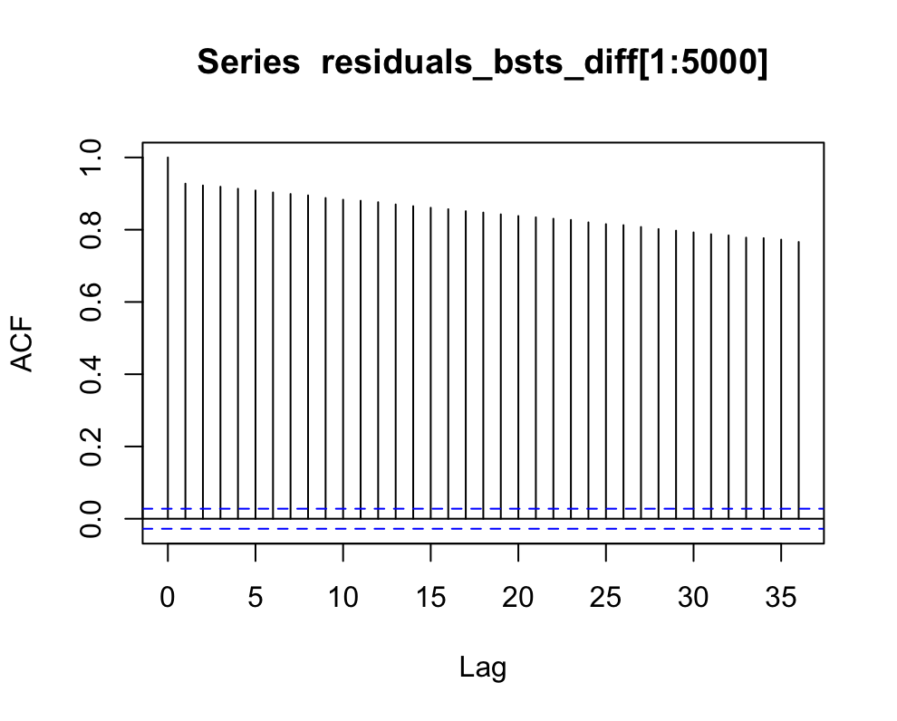
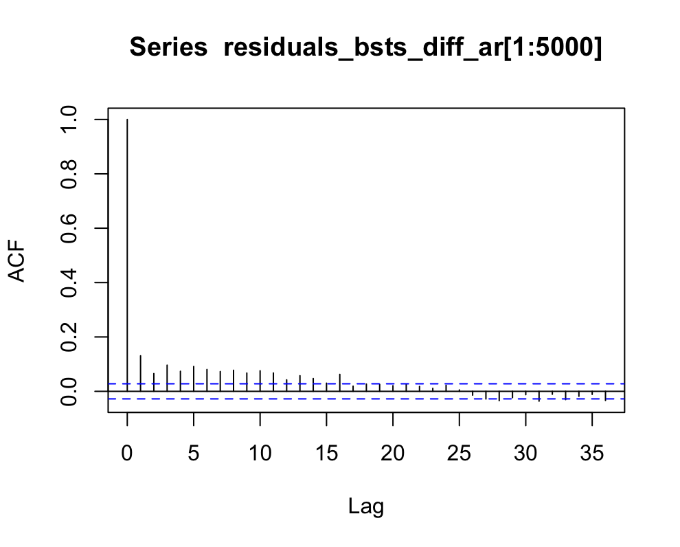
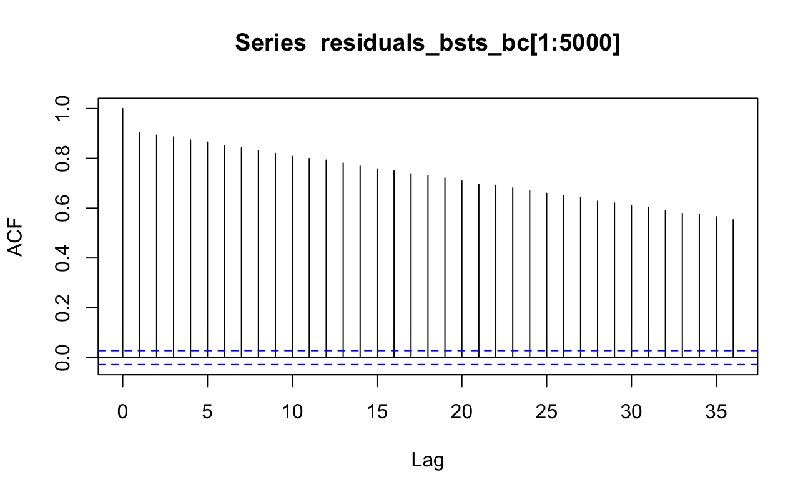
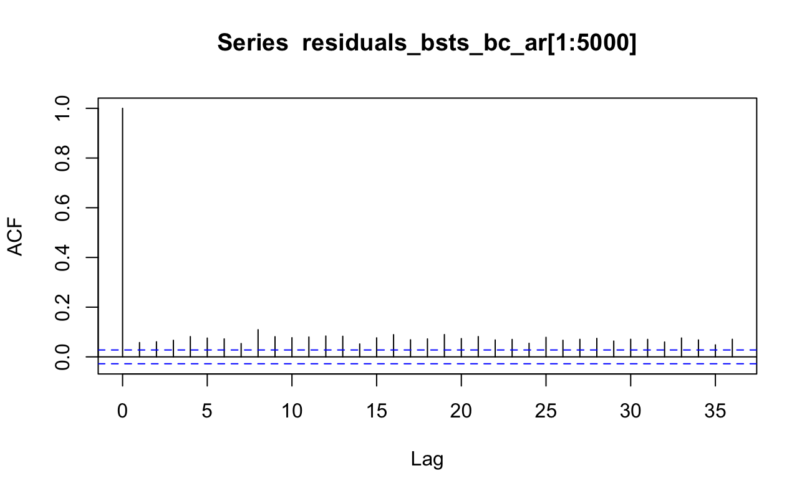

```{r setup, include=FALSE}
knitr::opts_chunk$set(echo = TRUE)
```

## Bayesian Structural Time Series (BSTS)

A Bayesian Structural Time Series (BSTS) model is a state-space approach particularly useful for handling noisy data and missing values. It consists of multiple components that capture long-term trends, account for seasonality, manage residual noise, and incorporate external covariates. Due to its Bayesian framework, the model integrates prior knowledge into its predictions and employs Markov Chain Monte Carlo (MCMC) methods to estimate parameter distributions. Its ability to model complex time series structures makes BSTS a powerful tool for both predictive analytics and causal inference.

### BSTS Use-Case for Forecasting Daily Air Quality Index in London

The BSTS model is particulary apt for forecasting Daily Air Quality Index (AQI) due to its ability to handle uncertainty and model complex temporal patterns.

1.  Captures long-term trends and seasonality

Air pollution levels in London exhibit both long-term trends and seasonal variations influenced by factors such as regulatory changes, weather patterns, and traffic emissions. Since BSTS explicitly models these components, it enhances AQI forecasting by accurately capturing these recurring patterns over time.

2.  Handles Noisy and Missing Data

Air quality data is often noisy due to fluctuations in environmental conditions, sensor inaccuracies, and missing observations. The BSTS model is particularly effective in managing these inconsistencies as it operates within a state-space framework, enabling robust estimation and improved forecast reliability even when data is incomplete or irregular.

3.  Bayesian Inferencing

A key advantage of BSTS over other time-series models is its Bayesian inference approach, which allows for the integration of prior knowledge and continuous updates as new data becomes available. This ensures that forecasts improve over time and remain resilient to evolving environmental patterns.

### Assumptions of BSTS

1.  The residual term follows a Gaussian distribution.
2.  The relationship between covariates and the target time series remains stable.
3.  The residual noise is independent over time and does not exhibit autocorrelation
4.  The time series can be decomposed into additive components.

## Building the model

### Exploratory Data Analysis

First, the data was explored and examined for trends, stationarity, and autocorrelation.

```{r, eval=FALSE}
dailyaqi <- read_excel("London_AQI_Daily.xlsx")
dailyaqi$Date <- as.Date(dailyaqi$Date, format="%Y-%m-%d")

# examine trends and autocorrelation
plot(dailyaqi$USAQI, type = 'l')
acf(dailyaqi$USAQI) 
pacf(dailyaqi$USAQI)

# check for stationarity 
adf.test(dailyaqi$USAQI)
kpss.test(dailyaqi$USAQI)
```

The ACF plot demonstrates gradual decay, suggesting that the data may be autocorrelated. The PACF plot has a sharp peak at lag 1, which may suggest that some autoregressive component might have to be added to the data.

The tests for stationarity are conflicting. The Augmented Dicky-Fuller test has a p-value \< 0.05, indicating that the data is stationary. However, the KPSS test also has a p-value \< 0.05, rejecting the null-hypothesis that the data is stationary. The discourse between the two tests indicates that the data may require transformations to fix the discourse and autocorrelations.

We conducted 4 different transformations (first-order differencing, box-cox transformation, log-transformation, and seasonal differencing) and tested each transformations for stationarity and autocorrelation.

```{r, eval=FALSE}

#### apply first-order differencing ####
diff_aqi <- diff(aqi_ts, differences = 1)

# test again for stationarity
adf.test(diff_aqi)  # stationary
kpss.test(diff_aqi) # stationary
acf(diff_aqi)
pacf(diff_aqi)


#### apply box-cox transformation ####
lambda <- BoxCox.lambda(aqi_ts)
boxcox_aqi <- BoxCox(aqi_ts, lambda)

# test again for stationarity
adf.test(boxcox_aqi)  # stationary
kpss.test(boxcox_aqi) # non-stationary
acf(boxcox_aqi)
pacf(boxcox_aqi)


#### apply differenced box-cox transformation ####
lambda <- BoxCox.lambda(aqi_ts)
boxcox_aqi <- BoxCox(aqi_ts, lambda)

diff_boxcox_aqi <- diff(boxcox_aqi, differences = 1)

# test again for stationarity
adf.test(diff_boxcox_aqi)  # stationary
kpss.test(diff_boxcox_aqi) # stationary
acf(diff_boxcox_aqi)
pacf(diff_boxcox_aqi)


#### apply log-transformation ####
log_aqi <- log(aqi_ts)

# test again for stationarity
adf.test(log_aqi)  # stationary
kpss.test(log_aqi)  # non-stationary
acf(log_aqi)
pacf(log_aqi)


#### apply seasonal differencing ####
seasonal_aqi <- diff(aqi_ts, lag = 365)

# test again for stationarity
adf.test(seasonal_aqi)  # stationary
kpss.test(seasonal_aqi) # stationary
acf(seasonal_aqi)
pacf(seasonal_aqi)
```

Based on the ACF plots and tests for stationarity, first-order differencing, differenced box-cox transformation, and seasonal differencing transforms the data into a stationary time series. However, there seems to still have some residual autocorrelation in these transformations, suggesting that including a AR component may improve the model. Therefore, we will run 3 BSTS models on each of these transformations, with and without an AR component. We can then compare the accuracy of each model and determine the best model to use.

To determine the best AR component to use, we then ran an auto.arima on each of the three transformations.

```{r, eval=FALSE}

best_model <- auto.arima(diff_aqi)
summary(best_model)
checkresiduals(best_model)

best_model_seasonal <- auto.arima(seasonal_aqi, seasonal = TRUE)
summary(best_model_seasonal)
checkresiduals(best_model_seasonal)

best_model_boxcox <- auto.arima(diff_boxcox_aqi)
summary(best_model_boxcox)
checkresiduals(best_model_boxcox)

```

Based on the auto.arima for each of the three transformations, an AR(5) for both the differenced and seasonally differences transformations was the best model. For the differenced box-cox transformation, an AR(2) was the best model. Therefore, these AR components will be used in the respective transformations.

### Model Execution

**Data Preprocessing**

The data was split into train and test datasets. The train dataset included over 10 years of data from 01-02-2013 to 12-31-2024. The test dataset then included the most recent AQI data for 2025, 01-01-2025 to 02-28-2025. These datasets were then turned into time series. The train and test time series were then transformed according to the three types chosen from above (first-order differencing, differenced box-cox, seasonal differencing).

```{r, eval=FALSE}

train_data <- subset(dailyaqi, Date < as.Date("2025-1-01"))
test_data  <- subset(dailyaqi, Date >= as.Date("2025-1-01"))


aqi_train_ts <- ts(train_data$USAQI, frequency = 365, start = c(2013, 1))
aqi_test_ts  <- ts(test_data$USAQI, frequency = 365, start = c(2025, 1))

# first-order differencing 
diff_train <- diff(aqi_train_ts, differences = 1)
diff_test <- diff(aqi_test_ts, differences = 1)

# differenced box-cox 
boxcox_train <- BoxCox(aqi_train_ts, lambda = (BoxCox.lambda(aqi_train_ts)))
boxcox_test <- BoxCox(aqi_test_ts, lambda = (BoxCox.lambda(aqi_test_ts)))

diff_boxcox_train <- diff(boxcox_train, differences = 1)
diff_boxcox_test <- diff(boxcox_test, differences = 1)

# seasonal differencing 
seasonal_train <- diff(aqi_train_ts, lag = 365)
# test not included as test data only includes two months of data

```

**Model Execution**

Six different models were run with the respective transformations and auto-regressive components:

1.  BSTS with First-order Differencing

```{r, eval=FALSE}

ss_diff <- list()
ss_diff <- AddLocalLinearTrend(ss_diff, y = diff_train)
ss_diff <- AddSeasonal(ss_diff, y = diff_train, nseasons = 7, season.duration = 1)   # weekly
ss_diff <- AddSeasonal(ss_diff, y = diff_train, nseasons = 30, season.duration = 1)  # monthly 
ss_diff <- AddSeasonal(ss_diff, y = diff_train, nseasons = 365, season.duration = 1)  # yearly

# run model with parallel processing to fix crashing 
options(mc.cores = parallel::detectCores() - 4) # use 10 cores
model_diff <- bsts(diff_train, state.specification = ss_diff, niter = 1000, ping = 100)

checkresiduals(model_diff)

# plot residuals 
residuals_bsts_diff <- residuals(model_diff)
residuals_bsts_diff <- rowMeans(model_diff$one.step.prediction.errors, na.rm = TRUE)
residuals_bsts_diff <- as.numeric(residuals(model_diff))
plot(residuals_bsts_diff, main = "BSTS Residuals", ylab = "Residuals", xlab = "Time")
acf(residuals_bsts_diff[1:5000])


# forecast the next 59 days (Jan 2025 - Feb 2025)
burn_diff <- SuggestBurn(0.1, model_diff)

pred_diff <- predict(model_diff, horizon = 59, burn = burn_diff, quantiles = c(.025, .975))


# Accuracy metrics 

actual_values <- test_data$USAQI

# Reverse differencing
forecast_values_diff <- cumsum(c(tail(train_data$USAQI, 1), pred_diff$mean))[-1] 

rmse <- sqrt(mean((actual_values - forecast_values_diff)^2))
mae  <- mean(abs(actual_values - forecast_values_diff))
mape <- mean(abs((actual_values - forecast_values_diff) / actual_values)) * 100

cat("RMSE for 1st order Differencing:", rmse, "\n")
cat("MAE for 1st order Differencing: ", mae, "\n")
cat("MAPE for 1st order Differencing:", mape, "%\n")


```

2.  BSTS with First-order Differencing with AR(5) Component

```{r, eval=FALSE}

ss_diff_ar <- list()
ss_diff_ar <- AddLocalLinearTrend(ss_diff_ar, y = diff_train)
ss_diff_ar <- AddAr(lags = 5, y = diff_train, state.specification = ss_diff_ar)
ss_diff_ar <- AddSeasonal(ss_diff_ar, y = diff_train, nseasons = 7, season.duration = 1)   # weekly
ss_diff_ar <- AddSeasonal(ss_diff_ar, y = diff_train, nseasons = 30, season.duration = 1)  # monthly 
ss_diff_ar <- AddSeasonal(ss_diff_ar, y = diff_train, nseasons = 365, season.duration = 1)  # yearly

# run model
options(mc.cores = parallel::detectCores() - 4) # use 10 cores
model_diff_ar <- bsts(diff_train, state.specification = ss_diff_ar, niter = 1000, ping = 100)

checkresiduals(model_diff_ar)

# plot residuals 
residuals_bsts_diff_ar <- residuals(model_diff_ar)
residuals_bsts_diff_ar <- rowMeans(model_diff_ar$one.step.prediction.errors, na.rm = TRUE)
residuals_bsts_diff_ar <- as.numeric(residuals(model_diff_ar))
plot(residuals_bsts_diff_ar, main = "BSTS Residuals", ylab = "Residuals", xlab = "Time")
acf(residuals_bsts_diff_ar[1:5000])


# forecast the next 59 days (Jan 2025 - Feb 2025)
burn_diff_ar <- SuggestBurn(0.1, model_diff_ar)

pred_diff_ar <- predict(model_diff_ar, burn = burn_diff_ar, horizon = 59)


# Accuracy metrics 

actual_values <- test_data$USAQI

# Revert differencing by adding the last known actual AQI value
forecast_values_diff_ar <- cumsum(c(tail(train_data$USAQI, 1), pred_diff_ar$mean))[-1] 

rmse <- sqrt(mean((actual_values - forecast_values_diff_ar)^2))
mae  <- mean(abs(actual_values - forecast_values_diff_ar))
mape <- mean(abs((actual_values - forecast_values_diff_ar) / actual_values)) * 100

cat("RMSE for 1st order Differencing w/ AR(5):", rmse, "\n")
cat("MAE for 1st order Differencing w/ AR(5): ", mae, "\n")
cat("MAPE for 1st order Differencing w/ AR(5):", mape, "%\n")

```

3.  BSTS with Differenced Box-Cox Transformation

```{r, eval=FALSE}

ss_bc <- list()
ss_bc <- AddLocalLinearTrend(ss_bc, y = diff_boxcox_train)
ss_bc <- AddSeasonal(ss_bc, y = diff_boxcox_train, nseasons = 7, season.duration = 1)   # weekly
ss_bc <- AddSeasonal(ss_bc, y = diff_boxcox_train, nseasons = 30, season.duration = 1)  # monthly 
ss_bc <- AddSeasonal(ss_bc, y = diff_boxcox_train, nseasons = 365, season.duration = 1)  # yearly

# run model with parallel processing to fix crashing 
options(mc.cores = parallel::detectCores() - 4) # use 10 cores
model_bc <- bsts(diff_boxcox_train, state.specification = ss_bc, niter = 1000, ping = 100)

checkresiduals(model_bc)

# plot residuals 
residuals_bsts_bc <- residuals(model_bc)
residuals_bsts_bc <- rowMeans(model_bc$one.step.prediction.errors, na.rm = TRUE)
residuals_bsts_bc <- as.numeric(residuals(model_bc))
plot(residuals_bsts_bc, main = "BSTS Residuals", ylab = "Residuals", xlab = "Time")
acf(residuals_bsts_bc[1:5000])


# forecast the next 59 days (Jan 2025 - Feb 2025)
pred_bc <- predict(model_bc, horizon = 59)


# Accuracy metrics 
actual_values <- test_data$USAQI

# reverse differencing and box-cox 
forecast_values_bc <- cumsum(c(tail(train_data$USAQI, 1), pred_bc$mean))[-1] 
forecast_values_real <- inv_boxcox(forecast_values_bc, lambda = (BoxCox.lambda(aqi_train_ts)))

rmse <- sqrt(mean((actual_values - forecast_values_real)^2))
mae  <- mean(abs(actual_values - forecast_values_real))
mape <- mean(abs((actual_values - forecast_values_real) / actual_values)) * 100

cat("RMSE for BC transformation:", rmse, "\n")
cat("MAE for BC transformation: ", mae, "\n")
cat("MAPE for BC transformation:", mape, "%\n")


```

4.  BSTS with Differenced Box-Cox Transformation with AR(2) Component

```{r, eval=FALSE}

ss_bc_ar <- list()
ss_bc_ar <- AddLocalLinearTrend(ss_bc_ar, y = diff_boxcox_train)
ss_bc_ar <- AddAr(lags = 2, y = diff_boxcox_train, state.specification = ss_bc_ar)
ss_bc_ar <- AddSeasonal(ss_bc_ar, y = diff_boxcox_train, nseasons = 7, season.duration = 1)   # weekly
ss_bc_ar <- AddSeasonal(ss_bc_ar, y = diff_boxcox_train, nseasons = 30, season.duration = 1)  # monthly 
ss_bc_ar <- AddSeasonal(ss_bc_ar, y = diff_boxcox_train, nseasons = 365, season.duration = 1)  # yearly

# run model with parallel processing to fix crashing 
options(mc.cores = parallel::detectCores() - 4) # use 10 cores
model_bc_ar <- bsts(diff_boxcox_train, state.specification = ss_bc_ar, niter = 1000, ping = 100)

checkresiduals(model_bc_ar)

# plot residuals 
residuals_bsts_bc_ar <- residuals(model_bc_ar)
residuals_bsts_bc_ar <- rowMeans(model_bc_ar$one.step.prediction.errors, na.rm = TRUE)
residuals_bsts_bc_ar <- as.numeric(residuals(model_bc_ar))
plot(residuals_bsts_bc_ar, main = "BSTS Residuals", ylab = "Residuals", xlab = "Time")
acf(residuals_bsts_bc_ar[1:5000])


# forecast the next 59 days (Jan 2025 - Feb 2025)
pred_bc_ar <- predict(model_bc_ar, horizon = 59)


# Accuracy metrics 
actual_values <- test_data$USAQI

# reverse differencing and box-cox 
forecast_values_bc_ar <- cumsum(c(tail(train_data$USAQI, 1), pred_bc_ar$mean))[-1] 
forecast_values_real_ar <- inv_boxcox(forecast_values_bc_ar, lambda = (BoxCox.lambda(aqi_train_ts)))

rmse <- sqrt(mean((actual_values - forecast_values_real_ar)^2))
mae  <- mean(abs(actual_values - forecast_values_real_ar))
mape <- mean(abs((actual_values - forecast_values_real_ar) / actual_values)) * 100

cat("RMSE for BC AR(2):", rmse, "\n")
cat("MAE for BC AR(2): ", mae, "\n")
cat("MAPE for BC AR(2):", mape, "%\n")

```

5.  BSTS with Seasonal Differencing

```{r, eval=FALSE}
ss_season <- list()
ss_season <- AddLocalLinearTrend(ss_season, y = seasonal_train)
ss_season <- AddSeasonal(ss_season, y = seasonal_train, nseasons = 7, season.duration = 1)   # weekly
ss_season <- AddSeasonal(ss_season, y = seasonal_train, nseasons = 30, season.duration = 1)  # monthly 
ss_season <- AddSeasonal(ss_season, y = seasonal_train, nseasons = 365, season.duration = 1)  # yearly

# run model with parallel processing to fix crashing 
options(mc.cores = parallel::detectCores() - 4) # use 10 cores
model_season <- bsts(seasonal_train, state.specification = ss_season, niter = 1000, ping = 100)

checkresiduals(model_season)

# plot residuals 
residuals_bsts_season <- residuals(model_season)
residuals_bsts_season <- rowMeans(model_season$one.step.prediction.errors, na.rm = TRUE)
residuals_bsts_season <- as.numeric(residuals(model_season))
plot(residuals_bsts_season, main = "BSTS Residuals", ylab = "Residuals", xlab = "Time")
acf(residuals_bsts_season[1:5000])


# forecast the next 59 days (Jan 2025 - Feb 2025)
pred_season <- predict(model_season, horizon = 59)


# Accuracy metrics 

actual_values <- test_data$USAQI

# Reverse seasonal differencing
forecast_values_season <- c(tail(train_data$USAQI, 365), tail(train_data$USAQI, 1) + cumsum(pred_diff$mean))[-(1:365)]

rmse <- sqrt(mean((actual_values - forecast_values_season)^2))
mae  <- mean(abs(actual_values - forecast_values_season))
mape <- mean(abs((actual_values - forecast_values_season) / actual_values)) * 100

cat("RMSE for Seasonal Differencing:", rmse, "\n")
cat("MAE for Seasonal Differencing: ", mae, "\n")
cat("MAPE for Seasonal Differencing:", mape, "%\n")

```

6.  BSTS with Seasonal Differencing with AR(5) Component

```{r, eval=FALSE}
ss_season_ar <- list()
ss_season_ar <- AddLocalLinearTrend(ss_season_ar, y = seasonal_train)
ss_season_ar <- AddAr(order = 5, y = seasonal_train, state.specification = ss_season_ar)
ss_season_ar <- AddSeasonal(ss_season_ar, y = seasonal_train, nseasons = 7, season.duration = 1)   # weekly
ss_season_ar <- AddSeasonal(ss_season_ar, y = seasonal_train, nseasons = 30, season.duration = 1)  # monthly 
ss_season_ar <- AddSeasonal(ss_season_ar, y = seasonal_train, nseasons = 365, season.duration = 1)  # yearly

# run model with parallel processing to fix crashing 
options(mc.cores = parallel::detectCores() - 4) # use 10 cores
model_season_ar <- bsts(seasonal_train, state.specification = ss_season_ar, niter = 1000, ping = 100)

checkresiduals(model_season_ar)

# plot residuals 
residuals_bsts_season_ar <- residuals(model_season_ar)
residuals_bsts_season_ar <- rowMeans(model_season_ar$one.step.prediction.errors, na.rm = TRUE)
residuals_bsts_season_ar <- as.numeric(residuals(model_season_ar))
plot(residuals_bsts_season_ar, main = "BSTS Residuals", ylab = "Residuals", xlab = "Time")
acf(residuals_bsts_season_ar[1:5000])


# forecast the next 59 days (Jan 2025 - Feb 2025)
pred_season_ar <- predict(model_season_ar, horizon = 59)


# Accuracy metrics 

actual_values <- test_data$USAQI

# Reverse seasonal differencing
forecast_values_season_ar <- c(tail(train_data$USAQI, 365), tail(train_data$USAQI, 1) + cumsum(pred_season_ar$mean))[-(1:365)]

rmse <- sqrt(mean((actual_values - forecast_values_season_ar)^2))
mae  <- mean(abs(actual_values - forecast_values_season_ar))
mape <- mean(abs((actual_values - forecast_values_season_ar) / actual_values)) * 100

cat("RMSE for Seasonal Differencing w/ AR(5):", rmse, "\n")
cat("MAE for Seasonal Differencing w/ AR(5): ", mae, "\n")
cat("MAPE for Seasonal Differencing w/ AR(5):", mape, "%\n")

```

###Model Results and Evaluation

1. BSTS with First-order Differencing 

The BSTS model with first-order differencing still revealed significant autocorrelation as indicated by the ACF plot. This would violate the assumptions of the BSTS model, therefore this model should not be used. 

```{r, echo=FALSE}
library(knitr)

```

The results for the BSTS with first-order differencing:

- RMSE for 1st order Differencing: 16.84943 

- MAE for 1st order Differencing:  14.31927 

- MAPE for 1st order Differencing: 38.51695%


2. BSTS with First-order Differencing with AR(5) Component

The BSTS model with first-order differencing revealed no autocorrelation as indicated by the ACF plot. This satisfies the assumptions of the BSTS model. 

```{r, echo=FALSE}
library(knitr)

```

However, the accuracy metrics for this model are not indicative of an accurate model as the RMSE, MAE, and MAPE are very high. 

- RMSE for 1st order Differencing w/ AR(5): 62.36532 

- MAE for 1st order Differencing w/ AR(5):  58.3799 

- MAPE for 1st order Differencing w/ AR(5): 139.591 %


3. BSTS with Differenced Box-Cox Transformation

The BSTS model with differenced Box-Cox Transformation still revealed significant autocorrelation as indicated by the ACF plot. This would violate the assumptions of the BSTS model, therefore this model should not be used. 


```{r, echo=FALSE}
library(knitr)

```

The accuracy metrics for this model are not indicative of an accurate model as the RMSE, MAE, and MAPE are very high. 

- RMSE for BC transformation: 43.60814 

- MAE for BC transformation:  39.99416 

- MAPE for BC transformation: 78.02078%


4.  BSTS with Differenced Box-Cox Transformation with AR(2) Component

The BSTS with differenced Box-Cox transformation with AR(2) component revealed no autocorrelation as indicated by the ACF plot. This satisfies the assumptions of the BSTS model. 

```{r, echo=FALSE}
library(knitr)

```

The accuracy metrics for this model are similar to the Box-Cox transformed model from above and also are not indicative of an accurate model as the RMSE, MAE, and MAPE are very high. 

RMSE for BC AR(2): 43.93517 

MAE for BC AR(2):  40.31006 

MAPE for BC AR(2): 78.66772%


5.  BSTS with Seasonal Differencing

The BSTS with seasonal differencing revealed no autocorrelation as indicated by the ACF plot. This satisfies the assumptions of the BSTS model. 


```{r, echo=FALSE}
library(knitr)

```

The accuracy metrics for this model are similar to the first-order differenced model from earlier and also are much lower than the majority of the models ran thus far. Although the RMSE, MAE, and MAPE are high, they are more moderate compared to previous models, indicating an improvement but still leaving room for better accuracy.

RMSE for Seasonal Differencing: 16.84943 

MAE for Seasonal Differencing:  14.31927 

MAPE for Seasonal Differencing: 38.51695%


6.  BSTS with Seasonal Differencing with AR(5) Component

##Conclusion
