```{r setup, include=FALSE, messages = FALSE, warnings = FALSE}
library(knitr)
library(kableExtra)
knitr::opts_chunk$set(echo = FALSE, warnings = FALSE, messages = FALSE)
# note that the code for our models is in a seperate file as the models take too
# long to run, hence, for the report we used imported images from our models.
```

# 1. Introduction

Air pollution is a critical public health concern in urban areas, where long-term exposure to poor air quality contributes to respiratory diseases, cardiovascular issues, and reduced life expectancy. London has historically had some of the worst air quality for urban areas, with the UK focusing more policy in recent times to target reducing the pollution and air quality. The importance of monitoring and forecasting air quality in London cannot be overstated, as it directly affects public health, the economy, and the overall livability of the city. Timely intervention, such as issuing health advisories, implementing traffic control measures, and enforcing emissions regulations, can help mitigate these risks. By forecasting the Air Quality Index (AQI), stakeholders like the Greater London Authority, UK Environment Agency, Public Health England, Transport for London, and industrial sectors can make informed decisions on pollution control, public health strategies, and urban planning. Additionally, London residents, commuters, and environmental advocacy groups all stand to benefit from better air quality management.

The data used for this project is sourced from Open-Meteo, an open-source weather API that provides free access to weather data for non-commercial use. The dataset contains daily AQI readings for London, using the United States Air Quality Index (USAQI) scale. This scale is commonly employed to assess and report air quality levels, reflecting concentrations of pollutants like particulate matter (PM2.5, PM10), ozone, and nitrogen dioxide. The data spans from January 2, 2013, to February 28, 2025, covering a significant period that captures both long-term trends and seasonal variations in air quality. By leveraging this dataset, the goal of this project is to develop an accurate time series forecasting model to predict future AQI levels, enabling stakeholders to issue early warnings for high pollution days, implement timely pollution control measures, and guide long-term environmental strategies aimed at improving air quality, protecting public health, and promoting sustainable urban development.


# 2. Data 

The AQI measurements are recorded at an hourly frequency. Initially, there were a few missing values causing minor gaps in the time series. To remedy this, we applied linear interpolation to estimate and fill in the missing hour values using values before and after the missing value, since we can assume for a given day the AQI values change slowly. After this, we aggregated the hour values by taking the mean to obtain daily AQI readings, which is the final data that we create our forecasting models with. We opted to use daily AQI since hourly AQI is too granular and there is not much variance of AQI within any given day. AQI values range from 17 to 155, with a median of 43. As mentioned previously, the data ranges over approximately 12 years. For our models, we used the data from January 2, 2013 - December 31, 2024 as our training set, and tested on data from January 1, 2025 - February 28, 2025.


## 2.2 Elementary Data Analysis

To determine if any transformation were needed in our data we initially looked into the distribution of the data, autocorrelations, and decompositions. 

```{r, echo=FALSE}
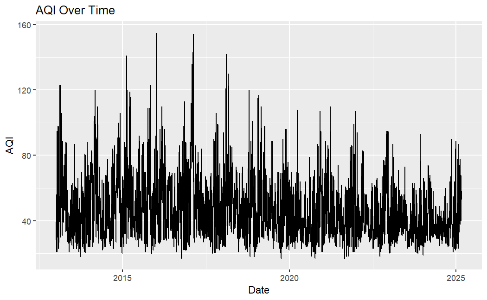
```


We can observe the AQI values over time, noticing a cyclical pattern between the years. There are also a few noticeable spikes, reaching close to the 160 range, particularly between 2017 and 2020. Due to the observed seasonality, we processed our time series with a frequency of 365, treating for one year as one season. 

```{r, echo=FALSE}
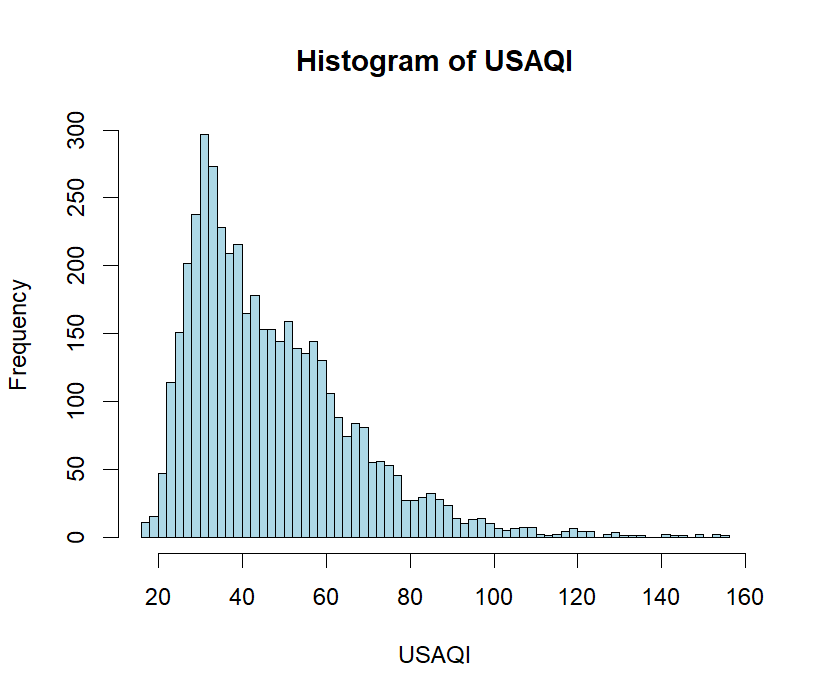
```


The distribution of AQI is right-skewed, with a majority of values falling in the 20-60 range. The right-skewed nature of this distribution suggests that we need to account for outliers in our data transformations. Although some values deviate significantly from the mean, they are still within a reasonable AQI range. Therefore, they were retained in the dataset.


```{r, echo=FALSE}
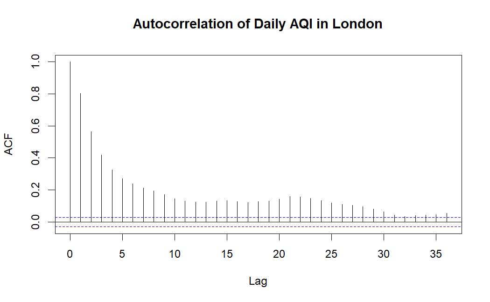
```

```{r, echo=FALSE}
knitr::include_graphics("Final figures/pacf.png")
```


Based on the ACF and PACF plots, the time series exhibits some autocorrelation, with many significant lags outside the confidence intervals in the ACF. This suggests that the data has a pronounced dependence structure across multiple time points, potentially indicating seasonality or cyclical behavior, as seen in the wave-like pattern of the ACF. The PACF, on the other hand, shows significant spikes only at the early lags, with the remaining lags falling within the confidence intervals. This indicates that the series likely follows an autoregressive process, where the current value is mainly influenced by its previous values, especially within the initial few lags. 


```{r, echo=FALSE}
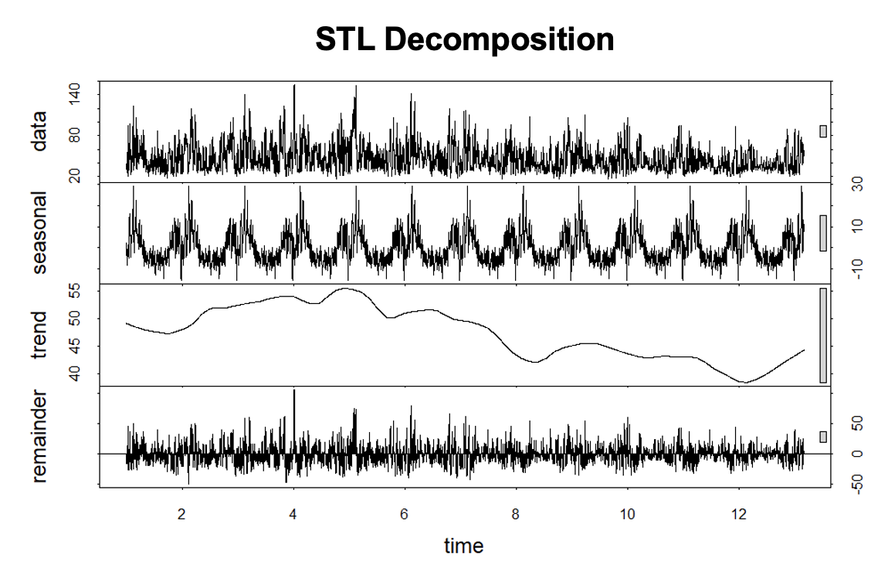
```


The STL decomposition further highlights the seasonal trend in the data, showing a pronounced pattern occurring yearly in the seasonal plot. There is also a strong trend that fluctuates between increasing and decreasing over time, with recent years having an increase. 

Finally, we conducted ADF and KPSS tests to check for stationarity of the data. The ADF test has a p-value of 0.01, allowing us to reject the null hypothesis, indicating stationarity for the data. However, the KPSS test has a p-value of 0.01, so we again reject the null hypothesis in favor for the alternative hypothesis that the data is non-stationary. 


## 2.3 Data Transformations


```{r, echo = FALSE}
data <- data.frame(
  Test = c("ADF", "KPSS"),
  Differenced = c(0.01, 0.1),
  `Box-Cox` = c(0.01, 0.01),
  `Box-Cox Differenced` = c(0.01, 0.1),
  Seasonal = c(0.01, 0.1)
)

knitr::kable(data, 
             col.names = c("Test", "Differenced", "Box-Cox", "Box-Cox Differenced", "Seasonal"), 
             caption = "ADF and KPSS Test Results for Different Transformations",
             digits = 2)%>%
  kableExtra::kable_styling("striped", full_width = FALSE)
```


Due to the data being non-stationary, we initially differenced the time series by one lag. This results in an ADF test and KPSS test result of stationary. Next, we performed a Box-Cox transformation to account for the outliers. This resulted in a KPSS test of non-stationary, so we differenced it by one lag, which resulted in an ADF test and KPSS test result of stationary. Finally, we applied a seasonal differencing transformation to account for the seasonality observed in the data. This also passed both stationary tests. We decided to use these three time series for each of our models to help determine the best-performing model as each transformation accounts for different patterns in the data. Since autocorrelation was detected in the ACF plot in Figure 2, we also will incorporate autoregressive (AR) components in our models.


# 3. Models

## 3.1 ARIMA, SARIMA, ARFIMA 

Autoregressive Integrated Moving Average (ARIMA), Seasonal ARIMA (SARIMA), and Autoregressive Fractionally Integrated Moving Average (ARFIMA) models were employed to forecast the given time series data. These models are particularly useful in capturing trends, seasonality, and long-range dependencies in time series data. ARIMA is well-suited for capturing temporal patterns and dependencies, while SARIMA accounts for seasonality, and ARFIMA is useful for handling long-memory processes. The choice of these models allows for a comprehensive evaluation of different types of dependencies within the dataset. The ARFIMA, ARIMA, and SARIMA are simpler models, allowing for easy interpretability, however, this trade-off is at the cost of potentially not capturing all of the complex underlying time series patterns.

The models were constructed using the original non-differenced data since they take differencing and stationarity into account when fitting the p, d, q values. Additionally, the models were constructed with the Box-Cox (non-differenced) data for further comparison. The ARIMA and SARIMA models were fitted using the auto.arima function, which selected the best parameters based on AIC. The ARFIMA model was estimated using the arfima function. ARFIMA, in particular, allows for fractional differencing, which provides flexibility in modeling long-memory properties without over-differencing the data.


```{r}
pdq_table <- data.frame(
  P = c(5, 5, 0.749),
  D = c(1, 1, 0.246),
  Q = c(0, 0, -0.253)
)

rownames(pdq_table) <- c("ARIMA", "SARIMA", "ARFIMA")

knitr::kable(pdq_table, caption = "Parameter Values: No Transformation", col.names = c("P", "D", "Q"))
```
```{r}
pdq_table <- data.frame(
  P = c(2, 2, 0.686),
  D = c(1, 1, 0.184),
  Q = c(0, 0, -0.201)
)

rownames(pdq_table) <- c("ARIMA", "SARIMA", "ARFIMA")

knitr::kable(pdq_table, caption = "Parameter Values: Box-Cox", col.names = c("P", "D", "Q"))
```

For both the non-differenced and Box-Cox transformation, the ARIMA and SARIMA models have the same parameter values for p, d, and q, respectively. All three of the models have a non-zero d value, relecting the non-stationarity of the data. 


These models assume that the data is univariate and stationary, residuals are uncorrelated white noise. To assess the model assumptions, ACF plots and Residuals vs. Fitted plots were examined.


```{r}
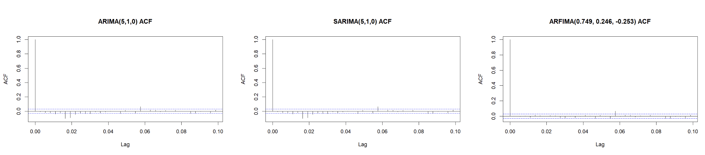
```

```{r}
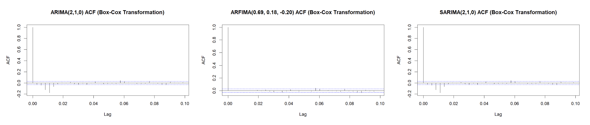
```


```{r}
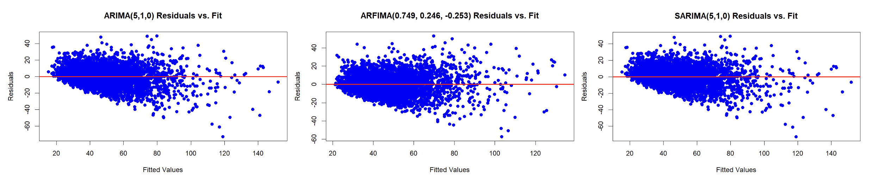
```

```{r}
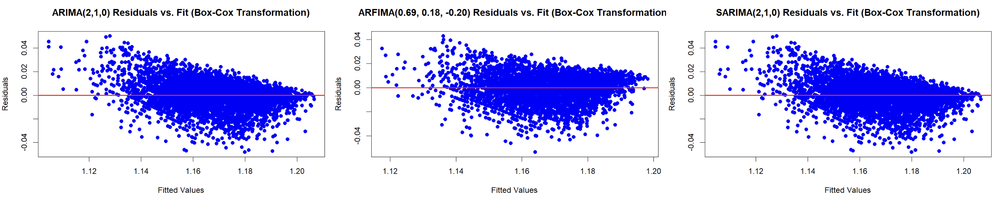
```


All of the ACF plots show autocorrelation with a few significant spikes for each of the models. All of the Residuals vs. Fitted plots reveal that the errors are not randomly distributed and without any significant pattern. We see clear signs of heteroscedasticity, suggesting that these models do not adequately capture the variance structure in the data. Thus, model assumptions regarding homoscedasticity are also violated. 

```{r}
rmse_table <- data.frame(
  Transformation = c("No Differencing", "Box-Cox Differencing"),
  ARIMA_RMSE = c(21.40, 18.46),
  SARIMA_RMSE = c(21.40, 18.46),
  ARFIMA_RMSE = c(18.91, 20.81)
)
knitr::kable(rmse_table, caption = "RMSE Comparison of Models", col.names = c("Transformation", "ARIMA RMSE", "SARIMA RMSE", "ARFIMA RMSE"))
```


For the ARIMA and SARIMA models, the Box-Cox transformation performed better, while the non-transformed data performed better for the ARFIMA model. The ARIMA and SARIMA models with the Box-Cox transformation had the lowest RMSEs. Since the SARIMA model accounts for seasonality, which is present in our data, this model was selected as the best performing model out of the six total, and therefore, this model was selected for forecasting. It is important to note that the Box-Cox transformed ARFIMA model performing worse than the non-transformed data is unexpected. Since Box-Cox transformation typically enhances model performance, the reason for this outcome remains unclear.

Given that the SARIMA model with Box-Cox Differencing had the lowest RMSE, it was selected for forecasting.

```{r}
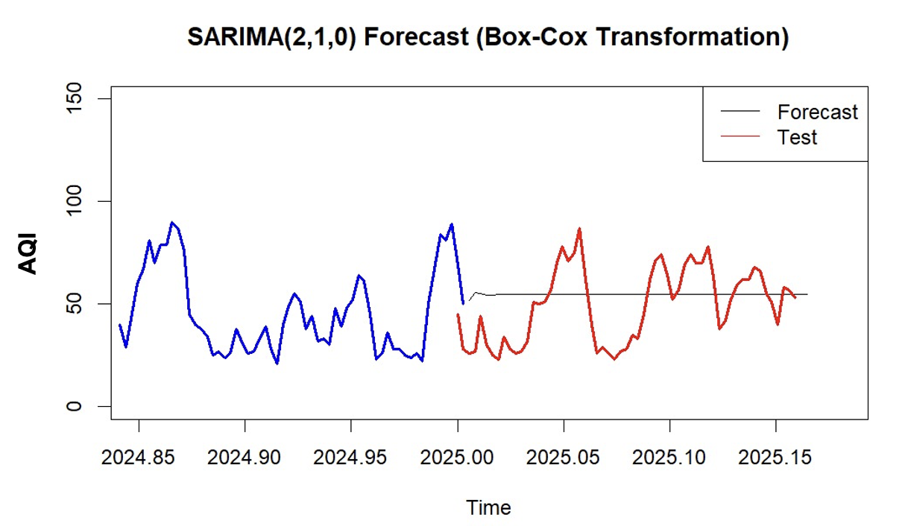
```

In the forecast, we observe that the trend for the predicted values is approximately linear and close to the average of the actual 2025 AQI values--not quite following the trend of the actual data, but being close enough in the value for a low RMSE. Despite the SARIMA model’s relatively better performance, the overall analysis indicates that key model assumptions are violated for all models. The ACF plots highlight significant autocorrelation in all of the models, contradicting the assumption of white noise errors. The residual vs. fitted plots suggest heteroscedasticity, further undermining the validity of these models. Given these violations, it is evident that none of these models provide a perfect fit, and further refinements—such as incorporating alternative differencing methods or hybrid modeling approaches—are needed to improve predictive accuracy. Additionally, since these models violate their assumptions, we will not consider them for further model comparison.


## 3.2 Exponential Smoothing

Exponential Smoothing models assign exponentially decreasing weights to past observations, giving more importance to recent data. Exponential Smoothing State Space Models (ETS) capture three main components: error, trend, and seasonality. These models are ideal for forecasting AQI values, as AQI data often exhibits both trends and seasonal patterns, with recent data playing a greater role, making ETS suitable for accurate short-term predictions in air quality monitoring.

```{r}
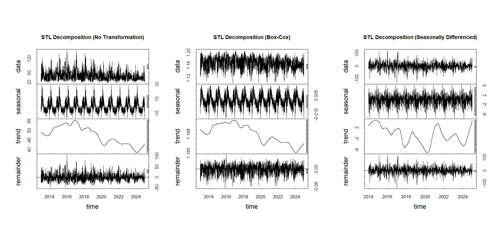
```

An ETS model only works well when the time series has an observable trend. The decomposition plots revealed that only the undifferenced, Box-Cox, and seasonally differenced time series had nonzero trends. The first order differenced and the differenced Box-Cox time series had zero-valued trends. Due to this, we only used the undifferenced, Box-Cox, and seasonally differenced transformations for our ETS models. 

Exponential Smoothing models assume that the data exhibits consistent trends and seasonality, and that recent observations are more relevant for forecasting future values. They handle both additive and multiplicative seasonality and assume that the underlying data structure remains stable over time without drastic changes.  There is no assumption about the errors. From the STL decomposition we observe that there is a trend and seasonality to the data, recent data values are more relevant for forecasting by nature of AQI and air pollution, the seasonality is additive, and the data is stationary.

```{r}
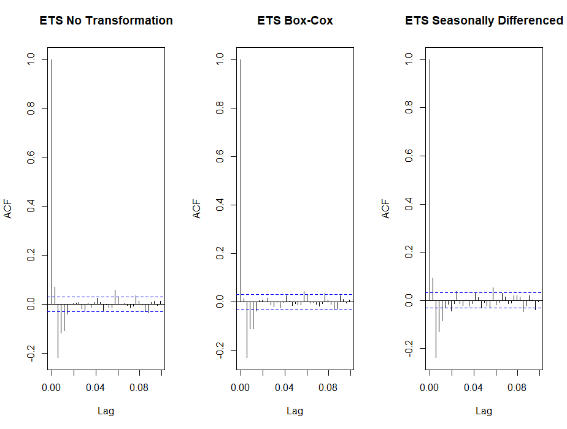
```


All three models had significant autocorrelations among the residuals as observed in the ACF plots. However, this is negligible since the ETS model has no assumptions on the errors and we can assume there will be correlation seen between observations in AQI due to the nature of pollution and environmental factors from previous days impacting a current day's AQI.


```{r}
rmse_results <- data.frame(
  Model = c("No Transformation", "Box-Cox", "Seasonally Differenced"),
  RMSE = c(61.73323,	17.94778,	22.82394	)
)


knitr::kable(rmse_results, caption = "RMSE Results for the ETS Models", 
             col.names = c("Model", "RMSE"), digits = 2)
```

The untransformed data had the highest RMSE, therefore, it performed the worst out of all three models. The Box-Cox transformation performed the best, having the lowest RMSE of 17.95. The forecast for this model is displayed. Due to the mathematical model, the ETS model predicts the same value for all 59 days of 2025, indicated by the flat line on the graph. Despite this line being linear and not following the trend of the actual test data closely, this model still performs well with a low RMSE.


```{r}
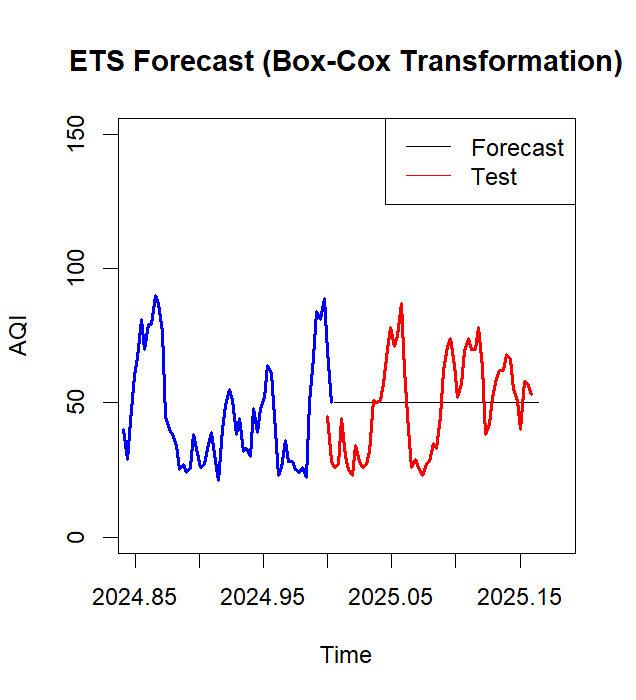
```

The ETS model essentially smooths the historic data to make a prediction. Due to this there is a trade-off with the prediction ability of the ETS model when it comes to sudden changes in AQI. The ETS model is better at predicting gradual changes compared to sudden changes. For example, it would not effectively predict AQI changes in the event of natural disasters such as wildfires. 


## 3.3 Bayesian Structural Time Series


A Bayesian Structural Time Series (BSTS) model is a state-space approach particularly useful for handling noisy data and missing values. It consists of multiple components that capture long-term trends, account for seasonality, manage residual noise, and incorporate external covariates. Due to its Bayesian framework, the model integrates prior knowledge into its predictions and employs Markov Chain Monte Carlo (MCMC) methods to estimate parameter distributions. Its ability to model complex time series structures makes BSTS a powerful tool for both predictive analytics and causal inference.

The BSTS model is particularly well-suited for forecasting the Daily Air Quality Index (AQI) due to its ability to handle uncertainty and model complex temporal patterns. It effectively captures long-term trends and seasonality in air pollution levels, which are influenced by factors such as regulatory changes, weather patterns, and traffic emissions. By explicitly modeling these components, BSTS enhances AQI forecasting by accurately capturing recurring patterns over time. Additionally, the model is highly effective at handling noisy and missing data, which is common in air quality data due to fluctuations in environmental conditions, sensor inaccuracies, and missing observations. Operating within a state-space framework, BSTS provides robust estimation and improved forecast reliability, even with incomplete or irregular data. A major advantage of BSTS is its Bayesian inference approach, which integrates prior knowledge and continuously updates forecasts as new data becomes available, ensuring that the model adapts to evolving environmental patterns and improves over time. 

However, it is worth noting that this model can be resource-intensive, making real-time forecasting more challenging. Additionally, while incorporating external covariates to enhance its predictions, an excessive number of weakly correlated variables may introduce noise and reduce the model’s performance. Therefore, despite the many advantages for using this model for forecasting AQI, there are some trade-offs that should be considered. 

### 3.3.a BSTS Model Execution 

We developed 6 different models for comparison, 3 of the models use the transformed data previously mentioned, and the remaining 3 add an additional AR component to account for the autocorrelations in the time series. The best AR component was determined by running an auto.arima for each of the three transformations. An AR(5) for both the differenced and seasonally differenced transformations
was the best model, while, an AR(2) was the best model for the differenced box-cox transformation. Therefore, these AR components will be used in the respective transformations.

For all six models, a local linear trend and multiple seasonal components (weekly, monthly, and yearly) were included to capture both long-term trends and short-term dependencies in the time series. The local linear trend allows for smooth variations over time, while the seasonal terms account for recurring patterns in AQI at different time scales, ensuring a comprehensive time series representation. For models with an autoregressive (AR) component, an additional step was included in the state-space model to add the respective AR component (2 or 5). Additionally, burn-in values were found for each model prior to prediction. This step helps discard initial estimates that may be biased or unstable, ensuring a more reliable starting point for prediction.

The assumptions for the model include that the residual term follows a Gaussian distribution, ensuring that the errors are normally distributed. Additionally, it is assumed that the relationship between the covariates and the target time series remains stable over time. The residual noise is also expected to be independent over time, without exhibiting autocorrelation, meaning the errors from one time point should not be related to those from another. Finally, it is assumed that the time series can be decomposed into additive components, such as trend, seasonality, and residuals, which allows for a more straightforward analysis and forecasting of the data.

```{r, echo=FALSE}
knitr::include_graphics("BSTS_SC/bsts_diff_acf.png")
```

The BSTS model with first-order differencing still revealed significant autocorrelation as indicated by the ACF plot. This violates the assumptions of the BSTS model, and therefore this model should not be further considered. 


```{r, echo=FALSE}
knitr::include_graphics("BSTS_SC/bsts_diff_ar.png")
```

The BSTS model with first-order differencing revealed no autocorrelation after adding an AR(5) component as indicated by the ACF plot. This satisfies the assumptions of the BSTS model and allows for further consideration of this model's accuracy. 


```{r}
knitr::include_graphics("BSTS_SC/BSTS_bc_acf.png")
```

The BSTS model with differenced Box-Cox Transformation still revealed significant autocorrelation as indicated by the ACF plot. This would violate the assumptions of the BSTS model and therefore this model should not be further considered. 


```{r, echo=FALSE}
knitr::include_graphics("BSTS_SC/BSTS_bc_ar_acf.png")
```

The BSTS with differenced Box-Cox transformation with an autoregressive AR(2) component revealed no autocorrelation as indicated by the ACF plot. This satisfies the assumptions of the BSTS model and allows for further consideration of this model's accuracy. 

```{r, echo=FALSE}
knitr::include_graphics("BSTS_SC/bsts_season_acf.png")
```


The BSTS with seasonal differencing revealed no autocorrelation as indicated by the ACF plot. This satisfies the assumptions of the BSTS model and allows for further consideration of this model's accuracy. 


```{r, echo=FALSE}
knitr::include_graphics("BSTS_SC/bsts_season_ar.png")
```


The BSTS with seasonal differencing revealed no autocorrelation as indicated by the ACF plot. This satisfies the assumptions of the BSTS model and allows for further consideration of this model's accuracy.

```{r, echo = FALSE}
rmse_data <- data.frame(
  Transformation = c("1st order Differencing", "1st order Differencing AR(5)", 
                     "Box-Cox Transformation", "Box-Cox AR(2)", 
                     "Seasonal Differencing", "Seasonal Differencing AR(5)"),
  RMSE = c(24.08, 28.62, 43.62, 43.94, 31.61, 22.64)
)

knitr::kable(rmse_data, 
             col.names = c("Transformation", "RMSE"), 
             caption = "RMSE for Different Transformations and BSTS Models") %>%
  kableExtra::kable_styling("striped", full_width = FALSE)
```


The accuracy metric for the first-differencing model with AR(5) are comparable to the first-differencing transformed model, reflecting moderate predictive performance. Similarly, the accuracy metrics for the differenced Box-Cox model with AR(2) are comparable to the Box-Cox transformed model, reflecting poor predictive performance and a poor fit due to the high RMSE. These elevated error values indicate that both models fail to effectively capture the underlying patterns in the data. In contrast, the accuracy metric for the seasonally differenced model is still relatively high, but noticeably lower than the differenced Box-Cox models, implying some improvement in predictive performance. Finally, the seasonally differenced model with AR(5) achieves the lowest RMSE, confirming that incorporating an autoregressive autoregressive component alongside differencing transformation has positively impacted the model's forecasting accuracy.

Among the six models evaluated, the BSTS with seasonal differencing with AR(5) component was the best-performing model. This specific data transformation met the assumption of the BSTS model, ensuring that the residuals were uncorrelated. It also achieved the lowest error metrics, although the metrics were still relatively high, indicating that the model does not accurately capture the underlying patterns in the data. The forecast of this model is presented below. 


```{r}
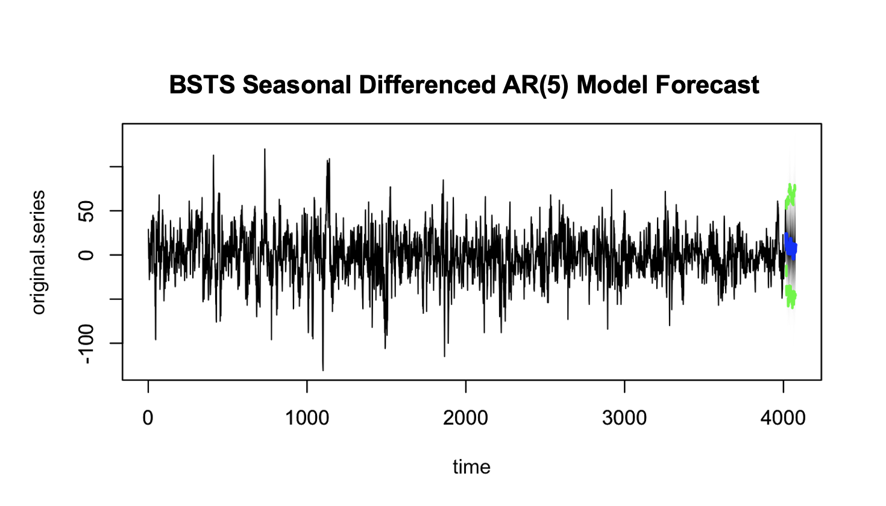
```


## 3.4 LSTM

For our final model, we used LSTM on as it outperforms traditional models for complex, nonlinear time series data, especially when long-term dependencies exist. We created a stacked model with double layer LSTM for learning the AQI data and two dense layers for predicting output, and our sequence window was for 60 days. The model was constructed using the untransformed time series since this model makes no assumptions about the data, therefore, no transformations were necessary. The data was also scaled using Min-Max Scaling for consistency. The model was trained for 5 epochs and, overall, gave great predictions with relatively low RMSE. Since the model is capable of capturing trends and long-term dependencies in the data, we felt that it was sufficient to only construct this model on the actual data.


```{r, echo=FALSE}
knitr::include_graphics("Final figures/lstm_plot.png")
```


As observed, the forecasted values closely follow the trend line of the data with a slight right shift. This highlights the model's high accuracy and ability to capture the complex trends underlying the data.

Unlike ARMA and ARIMA, there are no assumptions required whatsoever when performing time series modeling with Neural Networks. This is because Neural Networks are universal approximators, and with a deep and wide enough architecture, they can approximate any arbitrary function. 

The Naïve Persistence base model simply assumes tomorrow's AQI value to be the same as today's AQI. We can use this as a reference for our LSTM model. The Naïve model has a test RMSE of 10.6, while the LSTM has an RMSE of 10.2. This RMSE highlights that the LSTM model performs better than simpler models, as expected.

The LSTM model performs the best, but the trade-off is that the model is slightly computationally heavy, and since it is a neural network, it does not have any interpretability.

# 4. Results 

We constructed a total of 16 models by applying first-order differencing, Box-Cox transformation, and seasonal differencing to the data. These models include ARIMA, SARIMA, and ARFIMA, ETS, and BSTS models for certain transformations based on model assumptions. LSTM was performed on only the first-order differencing data. Furthermore, we included three additional models incorporating autoregressive terms for each of the transformations for the ETS, Holt-Winters, and BSTS models.

```{r}
models <- data.frame(
  Model = c("Differenced ARFIMA", "Differenced ETS", "BSTS Seasonal AR(5)", "LSTM"),
  Test_Accuracy = c(18.46, 17.95, 22.64, 10.20)
)

models %>%
  kable(caption = "Test Accuracy for  the Best Performing Models", 
        col.names = c("Model", "Test Accuracy")) %>%
  kable_styling("striped", full_width = FALSE)
```


From the initial set of models, it was observed that SARIMA with a Box-Cox transformation outperformed the other models. The SARIMA and ARIMA models performed the same and outperformed the ARFIMA models for the Box-Cox transformation. The best model in the second set, ETS using a Box-Cox transformation, performed much better than the no transformation model, having an RMSE slightly smaller by almost one third. In the third set, the seasonally differenced model with AR(5) outperformed the other BSTS models. While the first-order differenced model showed a lower test RMSE, it was disregarded as the best-performing model due to its violation of the uncorrelated errors assumption.

Ultimately, the LSTM model significantly outperformed all other models, with the lowest RMSE of 10.2. This is expected, as it is the most complex model across the four sets. With its high forecasting accuracy, this model is ideal for stakeholders to monitor AQI and implement intervention practices to reduce pollution, raise awareness of air quality hazards, and promote environmental safety.

With more time and data, model accuracy could improve, especially since AQI trends are closely linked to climate change, making recent data more relevant for forecasting. Reducing noise from interpolated values and possibly retaining the hourly component could further refine predictions, though its impact on model performance would need evaluation.

# 5. Discussion

In this project we aimed to forecast the daily air quality index (AQI) in London using a public dataset spanning over ten years. We followed a methodological approach and evaluated four different time series models to determine the most effective forecasting method– (1) Seasonal Autoregressive Integrated Moving Average (SARIMA), (2) Exponential Smoothing (ETS), (3) Bayesian Structural Time Series (BSTS), and (4) Long Short-Term Memory (LSTM).

Among these four types of models, the LSTM model outperforms all, achieving the lowest Root Mean Squared Error (RMSE) of 10.25, indicating high predictive accuracy. As LSTM is a neural network and the most advanced model evaluated, this result indicates that deep learning models are particularly effective for forecasting AQI, especially when long-term dependencies and non-linear patterns are present. While traditional models like SARIMA and ETS provided reasonable forecasts, their limitations in handling irregular variations highlighted the advantage of neural networks. These findings not only confirm that our objective of accurate AQI forecasting was successfully met, but also underscores the importance of selecting models that align with the complexity of the data.

Despite these results, there are several limitations worth noting and addressing. With additional time and computational resources, further hyperparameter tuning of the LSTM model—such as adjustments to the number of layers, learning rate, and batch size—could enhance both predictive performance and stability. Additionally, expanding the dataset to include data from other global cities could improve the model’s ability to generalize across different pollution patterns and seasonal fluctuations.

To further improve upon this work, future efforts could focus on hyperparameter tuning for the LSTM model to optimize its architecture and further reduce forecasting errors. Additionally, incorporating external variables such as weather conditions, traffic data, and pollutant sources may enhance predictive accuracy by capturing additional AQI influences. Furthermore, considering the incorporation of real-time forecasting could enhance the model's applicability for AQI monitoring and policy interventions.

By addressing these limitations and expanding the scope of the study, future research can refine AQI forecasting models to provide even more accurate and actionable insights, ultimately aiding policymakers and environmental agencies in mitigating air pollution.


# 6. Appendix

Data Citation:

Open Meteo (https://open-meteo.com/en/docs/air-quality-api)
METEO FRANCE, Institut national de l'environnement industriel et des risques (Ineris), Aarhus University, Norwegian Meteorological Institute (MET Norway), Jülich Institut für Energie- und Klimaforschung (IEK), Institute of Environmental Protection – National Research Institute (IEP-NRI), Koninklijk Nederlands Meteorologisch Instituut (KNMI), Nederlandse Organisatie voor toegepast-natuurwetenschappelijk onderzoek (TNO), Swedish Meteorological and Hydrological Institute (SMHI), Finnish Meteorological Institute (FMI), Italian National Agency for New Technologies, Energy and Sustainable Economic Development (ENEA) and Barcelona Supercomputing Center (BSC) (2022): CAMS European air quality forecasts, ENSEMBLE data. Copernicus Atmosphere Monitoring Service (CAMS) Atmosphere Data Store (ADS). 

Github Repository For Code Base:
https://github.com/johnmelel/TimeSeries_AQI_Forecasting


Member Contributions:

Anusha - EDA, exponential smoothing models, coalescing final code R script, coalescing individual member write-ups, and formatting final report RMD.

Sara - EDA, BSTS models, data transformations, discussion, coalescing final code R script, and formatting final report RMD.

Hritik - EDA, ARIMA/SARIMA/ARFIMA models, and introduction.

John - EDA, LSTM models, creating and managing github repository, and formatting final report RMD.


