```{r setup, include=FALSE, messages = FALSE, warnings = FALSE}
library(knitr)
library(kableExtra)
knitr::opts_chunk$set(echo = FALSE, warnings = FALSE, messages = FALSE)
# note that the code for our models is in a seperate file as the models take too
# long to run, hence, for the report we used imported images from our models.
```

# 1. Introduction

Air pollution is a critical public health concern in urban areas, particularly in London, where long-term exposure to poor air quality contributes to respiratory diseases, cardiovascular issues, and reduced life expectancy. The importance of monitoring and forecasting air quality in London cannot be overstated, as it directly affects public health, the economy, and the overall livability of the city. Timely intervention, such as issuing health advisories, implementing traffic control measures, and enforcing emissions regulations, can help mitigate these risks. By forecasting the Air Quality Index (AQI), stakeholders like the Greater London Authority, UK Environment Agency, Public Health England, Transport for London, and industrial sectors can make informed decisions on pollution control, public health strategies, and urban planning. Additionally, London residents, commuters, and environmental advocacy groups all stand to benefit from better air quality management.

The data used for this project is sourced from Open-Meteo, an open-source weather API that provides free access to weather data for non-commercial use. The dataset contains daily AQI readings for London, using the United States Air Quality Index (USAQI) scale. This scale is commonly employed to assess and report air quality levels, reflecting concentrations of pollutants like particulate matter (PM2.5, PM10), ozone, and nitrogen dioxide. The data spans from January 2, 2013, to February 28, 2025, covering a significant period that captures both long-term trends and seasonal variations in air quality. By leveraging this dataset, the goal of this project is to develop an accurate time series forecasting model to predict future AQI levels, enabling stakeholders to issue early warnings for high pollution days, implement timely pollution control measures, and guide long-term environmental strategies aimed at improving air quality, protecting public health, and promoting sustainable urban development.


# 2. Data 

The AQI measurements are recorded at an hourly frequency. Initially, there were a few missing values causing minor gaps in the time series. To remedy this, we applied linear interpolation to estimate and fill in the missing hour values using appropriate past values. After this, we aggregated the hour values to obtain daily AQI readings, which is the final data that we create our forecasting models with. AQI values range from 17 to 155, with a median of 43. As mentioned previously, the data ranges over approximately 12 years. For our models, we used the data from January 2, 2013 - December 31, 2024 as our training set, and tested on data from January 1, 2025 - February 28, 2025.


## 2.2 Elementary Data Analysis

To determine if any transformation were needed in our data we initially looked into the distribution of the data, autocorrelations, and decompositions. 

```{r, echo=FALSE}
knitr::include_graphics("aqi_plot.png")
```


We can observe the AQI values over time, noticing a cyclical pattern between the years. There are also a few noticeable spikes, reaching close to the 160 range, particularly between 2017 and 2020. Due to the observed seasonality, we processed our time series with a frequency of 365, treating for one year as one season. 

```{r, echo=FALSE}
knitr::include_graphics("outliers.png")
```


Tthe distribution of AQI is right-skewed, with a majority of values falling in the 20-60 range. The right-skewed nature of this distribution suggests that we need to account for outliers in our data transformations. Although some values deviate significantly from the mean, they are still within a reasonable AQI range. Therefore, they were retained in the dataset.


```{r, echo=FALSE}
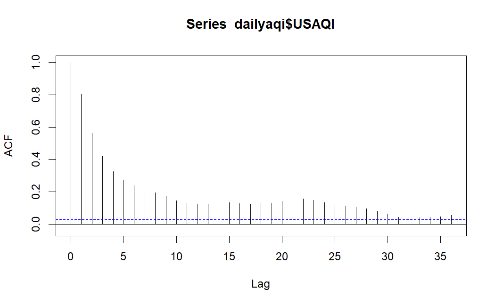
```

```{r, echo=FALSE}
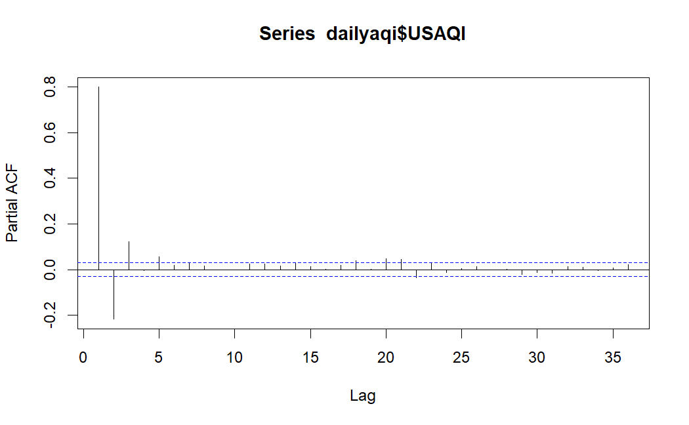
```


Based on the ACF and PACF plots, the time series exhibits some autocorrelation, with many significant lags outside the confidence intervals in the ACF. This suggests that the data has a pronounced dependence structure across multiple time points, potentially indicating seasonality or cyclical behavior, as seen in the wave-like pattern of the ACF. The PACF, on the other hand, shows significant spikes only at the early lags, with the remaining lags falling within the confidence intervals. This indicates that the series likely follows an autoregressive process, where the current value is mainly influenced by its previous values, especially within the initial few lags. 


```{r, echo=FALSE}
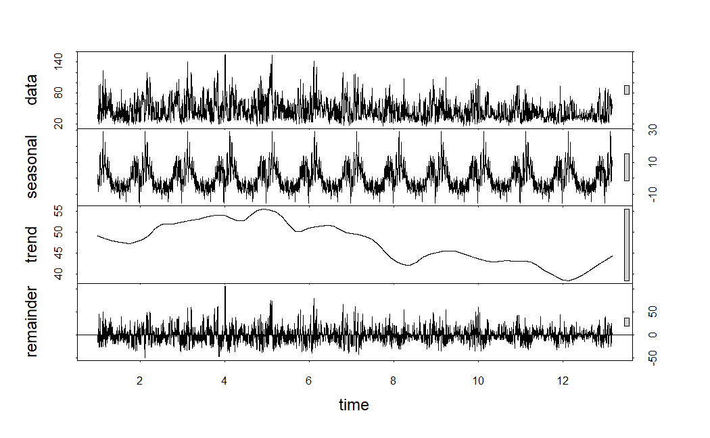
```


The STL decomposition further highlights the seasonal trend in the data, showing a pronounced pattern occurring yearly in the seasonal plot. There is also a strong trend that fluctuates between increasing and decreasing over time, with recent years having an increase. 

Finally, we conducted ADF and KPSS tests to check for stationarity of the data. The ADF test has a p-value of 0.01, allowing us to reject the null hypothesis, indicating stationarity for the data. However, the KPSS test has a p-value of 0.01, so we again reject the null hypothesis in favor for the alternative hypothesis that the data is non-stationary. 


## 2.3 Data Transformations


```{r, echo = FALSE}
data <- data.frame(
  Test = c("ADF", "KPSS"),
  Differenced = c(0.01, 0.1),
  `Box-Cox` = c(0.01, 0.01),
  `Box-Cox Differenced` = c(0.01, 0.1),
  Seasonal = c(0.01, 0.1)
)

knitr::kable(data, 
             col.names = c("Test", "Differenced", "Box-Cox", "Box-Cox Differenced", "Seasonal"), 
             caption = "ADF and KPSS Test Results for Different Transformations",
             digits = 2)%>%
  kableExtra::kable_styling("striped", full_width = FALSE)
```


Due to the data being non-stationary, we initially differenced the time series by one lag. This result in an ADF test and KPSS test result of stationary. Next, we performed a Box-Cox transformation to account for the outliers. This resulted in a KPSS test of non-stationary, so we differenced it by one lag, which resulted in an ADF test and KPSS test result of stationary. Finally, we applied a seasonal differencing transformation to account for the seasonality observed in the data. This also passed both stationary tests. We decided to use these three time series for each of our models to help determine the best-performing model as each transformation accounts for different patterns in the data. Since autocorrelation was detected in the ACF plot in Figure 2, we also will incorporate autoregressive (AR) components in our models.


# 3. Models

## 3.1 ARIMA, SARIMA, ARFIMA 

## 3.2 ETS, Holt Winters

Exponential Smoothing models assign exponentially decreasing weights to past observations, giving more importance to recent data. Exponential Smoothing State Space Models (ETS) capture three main components: error, trend, and seasonality. Holt-Winters (HW) is a variation of ETS that specifically accounts for trends and seasonality, with an additional smoothing parameter for seasonal data. The key difference is that while ETS handles both additive and multiplicative seasonality, HW focuses more on seasonal fluctuations. These models are ideal for forecasting AQI values, as AQI data often exhibits both trends and seasonal patterns, with recent data playing a greater role, making ETS and HW suitable for accurate short-term predictions in air quality monitoring.

Both the ETS and HW models were initially fit using each of the three data transformations. We then incorporated an autoregressive component to each of these models by constructing an auto-ARIMA model on each transformation, then combining the forecasting predictions with the predictions from the original models. 

The two models have similar assumptions. Exponential Smoothing models assume that the data exhibits consistent trends and seasonality, and that recent observations are more relevant for forecasting future values. They handle both additive and multiplicative seasonality and assume that the underlying data structure remains stable over time without drastic changes. Additionally, the model assumes that errors from one period are independent and not correlated with past errors. These assumptions allow Exponential Smoothing models, including ETS and Holt-Winters, to effectively forecast time series data with clear patterns, such as the AQI values, where recent data is more influential and trends and seasonality are important factors. Most of this is immediately satisfied before running our models. From the STL decomposition we observe that there is a trend and seasonality to the data,  recent data values are more relevant for forecasting by nature of AQI and air pollution, the seasonality is additive, and the data is stationary. After constructing our models, we can observe whether the uncorrelated and independent errors assumption is satisfied. 

```{r}
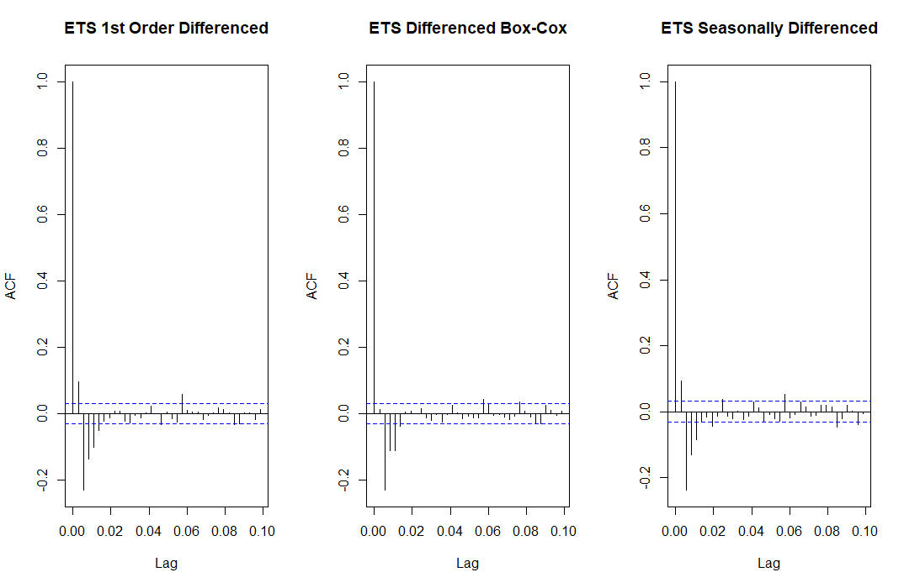
```

```{r}
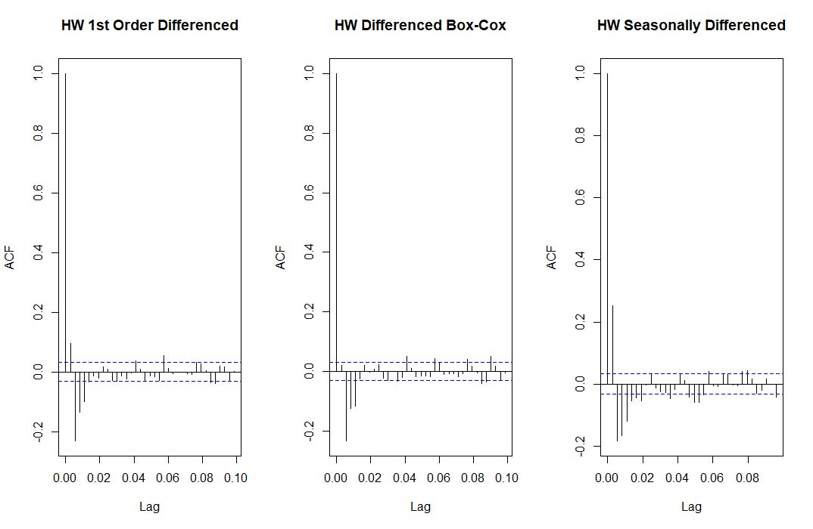
```

For the ETS and HW models on only the transformed data, there were significant autocorrelations between the residuals. This violates the assumptions of the model. 


```{r}
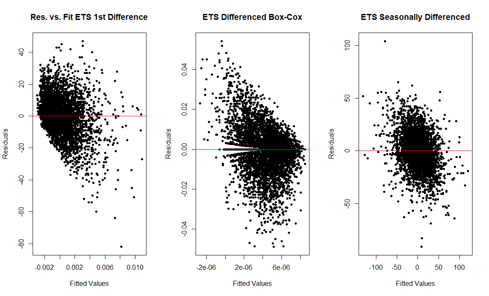
```

Additionally, the residual versus fit plot for the ETS model shows heteroskedasticity for the errors, further violating the model's assumptions. We incorporated the autoregressive components into each model to address this autocorrelation issue. 


```{r}
lj_box_results <- data.frame(
  Model = c("Differenced AR ETS", 
            "Differenced Box-Cox AR ETS", 
            "Seasonally Differenced AR ETS", 
            "Differenced AR HW", 
            "Differenced Box-Cox AR HW", 
            "Seasonally Differenced AR HW"),
  p_Value = c(2.2e-16, 2.2e-16, 2.2e-16, 2.2e-16, 2.2e-16, 2.2e-16)
)

lj_box_results$p_Value <- format(lj_box_results$p_Value, scientific = TRUE)

knitr::kable(lj_box_results, caption = "Ljung-Box Test Results for Different Models", 
             col.names = c("Model", "P-Value"))
```

Auto-ARIMA identified an AR component of 5 for both the first-order differenced and seasonally differenced transformations, while it recommended an AR component of 2 for the differenced Box-Cox transformation. Ljung-Box tests were applied to the residuals of all of the ETS and HW models incorporating the autoregressive errors, however, all of the tests had significant p-values, indicating that these models still exhbited autocorrelated residuals. Although, these autocorrelations are primarily significant in the early lags, suggesting that further modeling may be needed to address this issue.

```{r}
rmse_results <- data.frame(
  Model = c("ETS Differenced", "ETS Differenced AR", "ETS Differenced Box-Cox", 
            "ETS Differenced Box-Cox AR", "ETS Seasonal", "ETS Seasonal AR",
            "HW Differenced", "HW Differenced AR", "HW Differenced Box-Cox", 
            "HW Differenced Box-Cox AR", "HW Seasonal", "HW Seasonal AR"),
  RMSE = c(17.88, 18.19, 45.33, 44.69, 22.82, 24.29, 
           18.42, 19.28, 44.99, 43.42, 39.23, 39.30)
)


knitr::kable(rmse_results, caption = "RMSE Results for Different Models", 
             col.names = c("Model", "RMSE"), digits = 2)
```

The Holt-Winters model caused the seasonal and first-order differenced models to perform worse than the ETS model, although the differenced Box-Cox transformation performed better. For both models, the first-order differenced version was the best performing, although it yielded a lower RMSE for the simple ETS model. Adding autoregressive components to the models resulted in worse performance for both the first-order differenced and seasonally differenced ETS and HW models compared to when the autoregressive components were excluded. Overall, the first-order differenced ETS model performed the best among these models, having the lowest RMSE value of 17.88. The forecast for this model is below. However, it is important to note that all of these models had slight assumption violations that should be further explored and addressed in future work.

```{r}
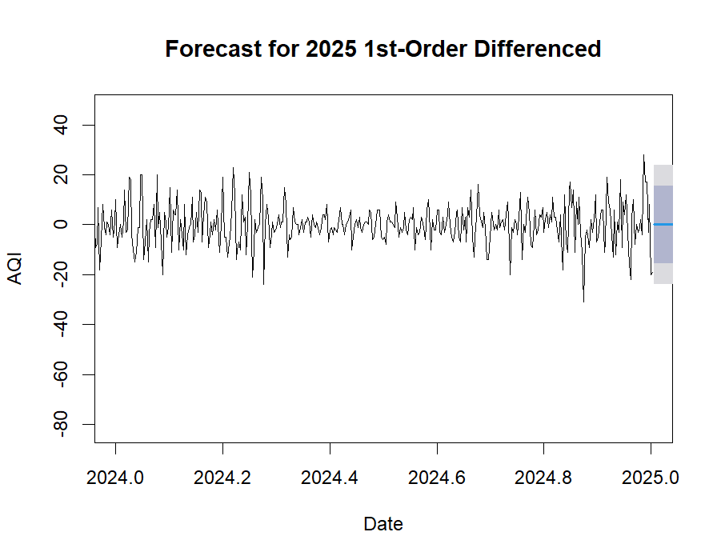
```


## 3.3 BSTS

A Bayesian Structural Time Series (BSTS) model is a state-space approach particularly useful for handling noisy data and missing values. It consists of multiple components that capture long-term trends, account for seasonality, manage residual noise, and incorporate external covariates. Due to its Bayesian framework, the model integrates prior knowledge into its predictions and employs Markov Chain Monte Carlo (MCMC) methods to estimate parameter distributions. Its ability to model complex time series structures makes BSTS a powerful tool for both predictive analytics and causal inference. The BSTS model is particularly apt for forecasting Daily Air Quality Index (AQI) due to its ability to handle uncertainty and model complex temporal patterns.

The BSTS model is particularly well-suited for forecasting the Daily Air Quality Index (AQI) due to its ability to handle uncertainty and model complex temporal patterns. It effectively captures long-term trends and seasonality in air pollution levels, which are influenced by factors such as regulatory changes, weather patterns, and traffic emissions. By explicitly modeling these components, BSTS enhances AQI forecasting by accurately capturing recurring patterns over time. Additionally, the model is highly effective at handling noisy and missing data, which is common in air quality data due to fluctuations in environmental conditions, sensor inaccuracies, and missing observations. Operating within a state-space framework, BSTS provides robust estimation and improved forecast reliability, even with incomplete or irregular data. A major advantage of BSTS is its Bayesian inference approach, which integrates prior knowledge and continuously updates forecasts as new data becomes available, ensuring that the model adapts to evolving environmental patterns and improves over time.

We developed 6 different models for comparison, 3 of the models use the transformed data previously mentioned, and the remaining 3 add an aditional AR component to account for the autocorrelations in the time series. 

The assumptions for the model include that the residual term follows a Gaussian distribution, ensuring that the errors are normally distributed. Additionally, it is assumed that the relationship between the covariates and the target time series remains stable over time. The residual noise is also expected to be independent over time, without exhibiting autocorrelation, meaning the errors from one time point should not be related to those from another. Finally, it is assumed that the time series can be decomposed into additive components, such as trend, seasonality, and residuals, which allows for a more straightforward analysis and forecasting of the data.

```{r, echo=FALSE}
knitr::include_graphics("BSTS_SC/bsts_diff_acf.png")

```

The BSTS model with first-order differencing still revealed significant autocorrelation as indicated by the ACF plot. This violates the assumptions of the BSTS model, and therefore this model should not be further considered. 


```{r, echo=FALSE}
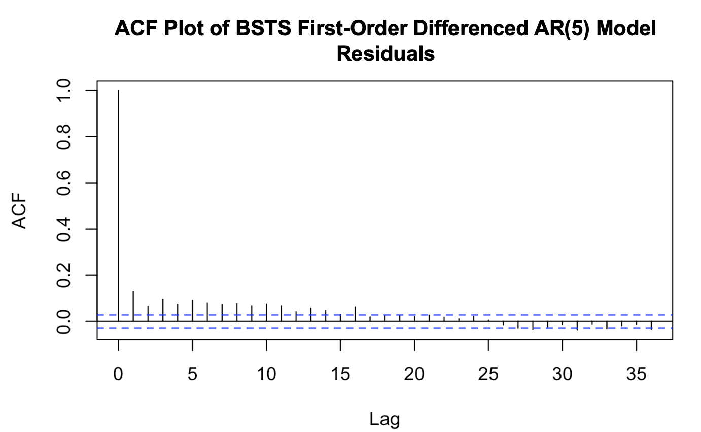
```

The BSTS model with first-order differencing revealed no autocorrelation after adding an AR(5) component as indicated by the ACF plot. This satisfies the assumptions of the BSTS model and allows for further consideration of this model's accuracy. 


```{r}
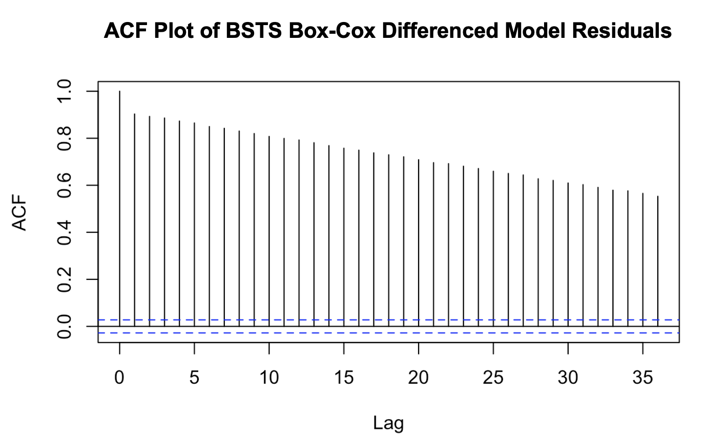
```

The BSTS model with differenced Box-Cox Transformation still revealed significant autocorrelation as indicated by the ACF plot. This would violate the assumptions of the BSTS model and therefore this model should not be further considered. 


```{r, echo=FALSE}
knitr::include_graphics("BSTS_SC/BSTS_bc_ar_acf.png")
```

The BSTS with differenced Box-Cox transformation with an autoregressive AR(2) component revealed no autocorrelation as indicated by the ACF plot. This satisfies the assumptions of the BSTS model and allows for further consideration of this model's accuracy. 

```{r, echo=FALSE}
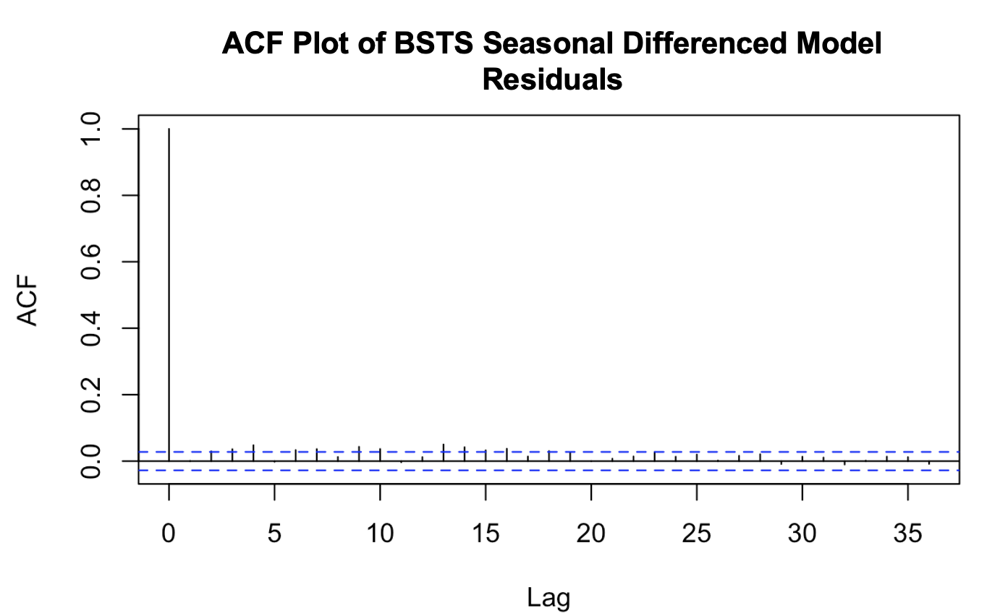
```


The BSTS with seasonal differencing revealed no autocorrelation as indicated by the ACF plot. This satisfies the assumptions of the BSTS model and allows for further consideration of this model's accuracy. 


```{r, echo=FALSE}
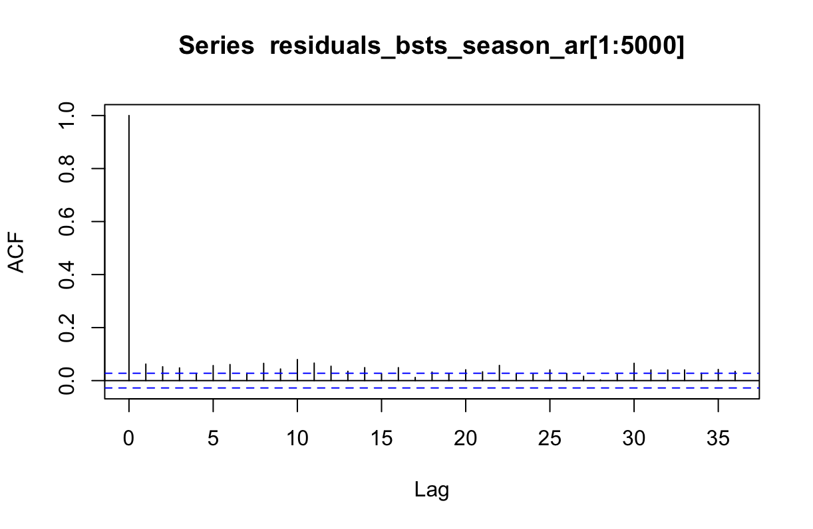
```


The BSTS with seasonal differencing revealed no autocorrelation as indicated by the ACF plot. This satisfies the assumptions of the BSTS model and allows for further consideration of this model's accuracy.

```{r, echo = FALSE}
rmse_data <- data.frame(
  Transformation = c("1st order Differencing", "1st order Differencing AR(5)", 
                     "Box-Cox Transformation", "Box-Cox AR(2)", 
                     "Seasonal Differencing", "Seasonal Differencing AR(5)"),
  RMSE = c(16.85, 62.36, 43.62, 43.94, 31.61, 22.64)
)

knitr::kable(rmse_data, 
             col.names = c("Transformation", "RMSE"), 
             caption = "RMSE for Different Transformations and Models") %>%
  kableExtra::kable_styling("striped", full_width = FALSE)
```


The accuracy metric for the first-differencing model with AR(5) indicates poor predictive performance, as evidenced by the high RMSE value, which suggests a poor fit. Similarly, the accuracy metrics for the differenced Box-Cox model with AR(2) are comparable to the Box-Cox transformed model, also reflecting poor predictive performance and a poor fit due to the high RMSE. These elevated error values indicate that both models fail to effectively capture the underlying patterns in the data. In contrast, the accuracy metric for the seasonally differenced model is still relatively high, but noticeably lower than the previous models, implying some improvement in predictive performance. Finally, the seasonally differenced model with AR(5) achieves a moderate level of accuracy and registers the lowest error value among all six models tested, suggesting that incorporating an autoregressive autoregressive component alongside seasonal differencing has positively impacted the model's forecasting accuracy.

Among the six models evaluated, the BSTS with seasonal differencing with AR(5) component was the best-performing model. This specific data transformation met the assumption of the BSTS model, ensuring that the residuals were uncorrelated. It also achieved the lowest error metrics, although the metrics were still relatively high, indicating that the model does not accurately capture the underlying patterns in the data.


## 3.4 LSTM

For our final model, we used LSTM on as it outperforms traditional models for complex, nonlinear time series data, especially when long-term dependencies exist. We created a stacked model with double layer LSTM for learning the differenced data and two dense layers for predicting output, and our sequence window was for 60 days. The data was also scaled using Min-Max Scaling for consistency. The model was trained for 5 epochs and, overall, gave great predictions with relatively low RMSE. Since the model is capable of capturing trends and long-term dependencies in the data, we felt that it was sufficient to only construct this model on the differenced data.


```{r, echo=FALSE}
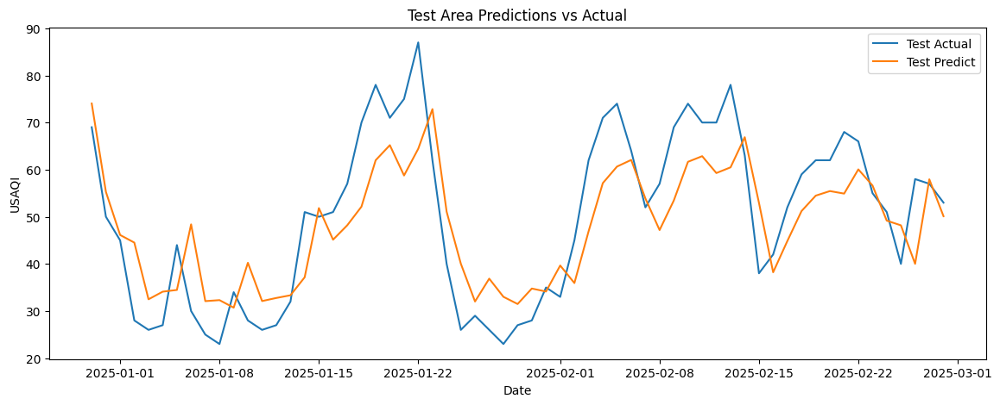
```

```{r, echo=FALSE}
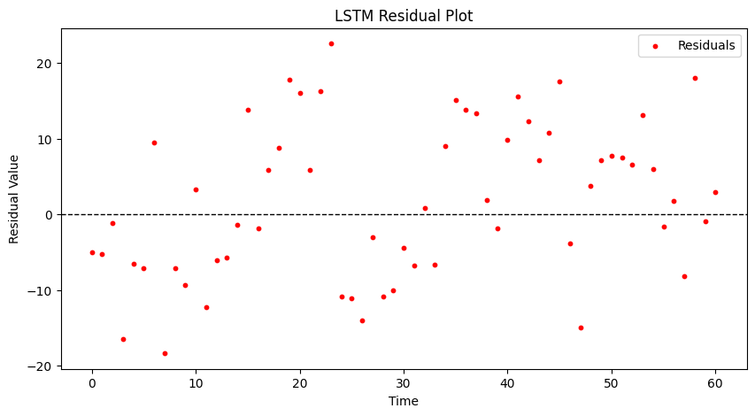
```

As observed, the forecasted values closely follow the trend line of the data with a slight right shift. The prediction residuals are non-correlated with a mean around 0, further supporting that this is a good model. 

This model assumes that the data has sequential long-term dependencies, a stationary time series, sufficient data size, non-linearity, and no strong autocorrelations, constant variance, and zero-mean in the residuals. All of these assumptions are satisfied since we have seasonal data indicating long-term dependencies, our data is differenced to make it stationary, we have 12 years worth of training data, there is a non-linear pattern in the time series, and the errors are uncorrelated with zero mean and homoscedasticity. Since no assumptions are violated, this model a good fit for the differenced data. 

The Naïve Persistence base model simply assumes tomorrow's AQI value to be the same as today's AQI. We can use this as a reference for our LSTM model. The Naïve model has a test RMSE of 10.6, while the LSTM has an RMSE of 10.20. This RMSE highlights that the LSTM model performs better than simpler models, as expected.


# 4. Results 

```{r}
models <- data.frame(
  Model = c("Differenced ARFIMA", "Differenced ETS", "Seasonal AR(5)", "LSTM"),
  Test_Accuracy = c(18.68, 17.88, 22.64, 10.20)
)

models %>%
  kable(caption = "Test Accuracy for Different Models", 
        col.names = c("Model", "Test Accuracy")) %>%
  kable_styling("striped", full_width = FALSE)
```


We constructed a total of 28 models by applying first-order differencing, Box-Cox transformation, and seasonal differencing to the data. These models include ARIMA, SARIMA, and ARFIMA, ETS, Holt-Winters, and BSTS models for each transformation and LSTM on only the first-order differencing data. Furthermore, we included three additional models incorporating autoregressive terms for each of the transformations for the ETS, Holt-Winters, and BSTS models.

From the initial set of models, it was observed that ARFIMA outperformed both SARIMA and ARIMA, which exhibited similar performance. In particualy, the first-order differenced ARFIMA performed the best from this set. Additionally, general exponential smoothing (ETS) models performed better than the Holt-Winters models for first-order differencing and seasonal differencing, while the Box-Cox Holt-Winters models outperformed the rest. The best model in the second set, the first-order differenced ETS, performed slightly better than the first-order differenced ARFIMA model, having an RMSE slightly smaller by 1. However, despite the low to moderate RMSE values and their applicability to the forecasting scenario, none of the models in the first and second sets satisfied the assumption of uncorrelated errors. Therefore, these models cannot be considered well-performing even if they have lower RMSEs than the BSTS models. In the third set, the seasonally differenced model with AR(5) outperformed the other BSTS models. While the first-order differenced model showed a lower test RMSE, it was disregarded as the best-performing model due to its violation of the uncorrelated errors assumption.

Ultimately, the LSTM model significantly outperformed all other models, with the lowest RMSE of 10.20. This is expected, as it is the most complex model across the four sets. With its high forecasting accuracy, this model is ideal for stakeholders to monitor AQI and implement intervention practices to reduce pollution, raise awareness of air quality hazards, and promote environmental safety.


# 5. Discussion

In this project we aimed to forecast the daily air quality index (AQI) in London using a public dataset spanning over ten years. We followed a methodological approach and evaluated four different time series models to determine the most effective forecasting method– (1) Seasonal Autoregressive Integrated Moving Average (SARIMA), (2) Exponential Smoothing (ETS), (3) Bayesian Structural Time Series (BSTS), and (4) Long Short-Term Memory (LSTM).

Among these four types of models, the LSTM model outperforms all, achieving the lowest Root Mean Squared Error (RMSE) of 10.25, indicating high predictive accuracy. As LSTM is a neural network and the most advanced model evaluated, this result indicates that deep learning models are particularly effective for forecasting AQI, especially when long-term dependencies and non-linear patterns are present. While traditional models like SARIMA and ETS provided reasonable forecasts, their limitations in handling irregular variations highlighted the advantage of neural networks. These findings not only confirm that our objective of accurate AQI forecasting was successfully met, but also underscores the importance of selecting models that align with the complexity of the data.

To improve upon this work, future efforts could focus on hyperparameter tuning for the LSTM model to optimize its architecture and further reduce forecasting errors. Additionally, incorporating external variables such as weather conditions, traffic data, and pollutant sources may enhance predictive accuracy by capturing additional AQI influences. Furthermore, considering the incorporation of real-time forecasting could enhance the model's applicability for AQI monitoring and policy interventions. 


# 6. Appendix

Data Citation:

Open Meteo (https://open-meteo.com/en/docs/air-quality-api)
METEO FRANCE, Institut national de l'environnement industriel et des risques (Ineris), Aarhus University, Norwegian Meteorological Institute (MET Norway), Jülich Institut für Energie- und Klimaforschung (IEK), Institute of Environmental Protection – National Research Institute (IEP-NRI), Koninklijk Nederlands Meteorologisch Instituut (KNMI), Nederlandse Organisatie voor toegepast-natuurwetenschappelijk onderzoek (TNO), Swedish Meteorological and Hydrological Institute (SMHI), Finnish Meteorological Institute (FMI), Italian National Agency for New Technologies, Energy and Sustainable Economic Development (ENEA) and Barcelona Supercomputing Center (BSC) (2022): CAMS European air quality forecasts, ENSEMBLE data. Copernicus Atmosphere Monitoring Service (CAMS) Atmosphere Data Store (ADS). 

Github Repository For Code Base:
https://github.com/johnmelel/TimeSeries_AQI_Forecasting


Member Contributions:

Anusha - EDA, exponential smoothing models, coalescing final code R script, formatting final report RMD and coalescing individual member write-ups

Sarah - EDA, BSTS models, data transformations

Hritik - EDA, ARIMA/SARIMA/ARFIMA models

John - EDA, LSTM models, made github repository, formatting final report RMD 


